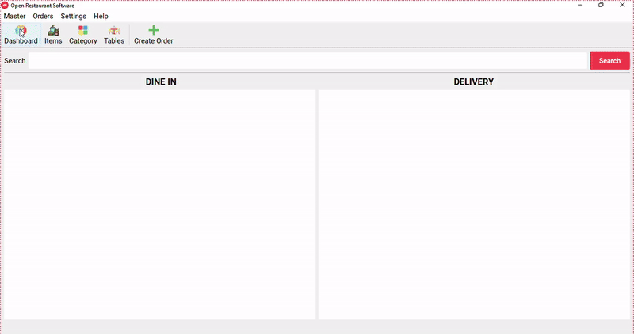

# <h1 align="center">Restaurant POS </h1>
 
 

 <a href="https://drive.google.com/uc?id=1AmUOUw8Bi9wbRmaMoDNSbxQsVM1a6VCO&export=download">POS LINK</a>

 
Restaurant POS Python Qt Restaurant Billing Software built with Python and Qt, designed to streamline restaurant operations. This application provides a complete suite of features, including Category Management, Item Management, Orders, Tables, and Reports.

## Key Features

- **Category Management**: Manage food and beverage categories for easy organization.
- **Item Management**: Add, update, or delete menu items, with detailed information for each item.
- **Orders**: Create and track orders in real-time to improve service efficiency.
- **Table Management**: Organize table seating and status to streamline reservations and service.
- **Reports**: Generate comprehensive reports on sales, order history, and more for insightful analysis.
# <h1 align= "center">Restaurant POS </h1>

\users\haroun\AppData\Roaming\Python\Python313\Scripts\pyinstaller.exe --onefile --windowed --clean --add-data "ui;ui" --add-data "images;images" --add-data "db/database.db;db"  --add-data "db/database_.db;db" --add-data "icon;icon" --icon "icon\icon.ico" main.py   
# setup
python -m PyInstaller --onefile --windowed --clean --add-data "ui;ui" --add-data "images;images" --add-data "db/database.db;db" --add-data "db/database_.db;db" --add-data "icon;icon" --icon "icon\icon.ico" main.py

 # image addition
